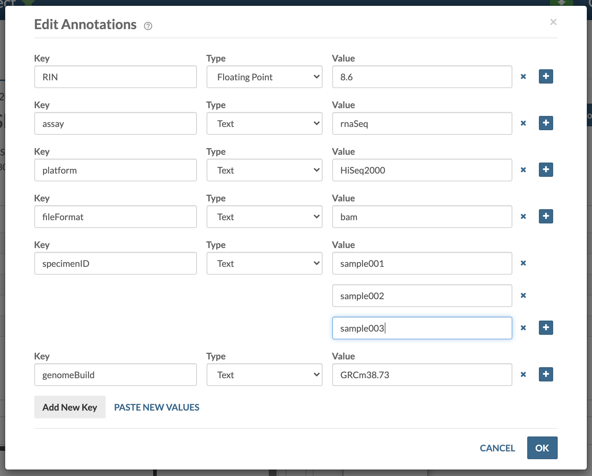

`Annotations` are key-value pairs stored as metadata for `Projects`, `Files`, `Folders`, `Tables` and `Views`. Annotations help users search for and find data. 

Annotations can be based on an existing ontology or controlled vocabulary, or can be created in an *ad hoc* manner and modified later as the metadata evolves. Annotations are a powerful tool used to systematically group and/or describe things (files or data, etc.) in Synapse.
 
 For example, if you have uploaded a collection of alignment files in the BAM file format from an RNA-sequencing experiment, each representing a sample and experimental replicate, you can use annotations to surface this information in a structured way. Sometimes, users encode this information in file names, e.g., `sampleA_conditionB.bam`, which makes it "human-readable" but not searchable. 

 In this case, the annotations you may want to add might look like this:


## How to Assign Annotations

Annotations are either added during upload or at a later date. Functionality for working with annotations is available in the command line client, the [Python client](https://python-docs.synapse.org/build/html/Views.html#updating-annotations-using-view), the [R client](https://r-docs.synapse.org/articles/views.html#updating-annotations-using-view), or from the web. Using the programmatic clients facilitates batch and automated population of annotations across many files. The web client can be used to bulk update many files using [Views]({{ site.baseurl }}).

### Add New Annotations and Modify Existing Annotations

To add or modify annotations annotations on Projects, Files, Folders, Tables or Views in the web client, click **Tools** in the upper right corner and **Annotations**.


Use the **+** icon to add multiple values for a single key and the **x** icon to remove values.




To add annotations on multiple files, refer to the In Practice article [Managing Custom Metadata at Scale]({{ site.baseurl }}) for a tutorial on efficiently leveraging [Views]({{ site.baseurl }}) for annotation management.

##### Command line

To add annotations on a new file during upload: 
```bash
synapse store sampleA_conditionB.bam --parentId syn00123 --annotations '{"fileFormat":"bam", "assay":"rnaSeq"}'
```

To add annotations on an existing file: 
```bash
synapse set-annotations --id syn00123 --annotations '{"fileFormat":"bam", "assay":"rnaSeq"}'
```

##### Python

To add annotations on a new file during upload:
```python
entity = File(path="sampleA_conditionB.bam",parent="syn00123")
entity.annotations = {"fileFormat":"bam", "assay":"rnaSeq"}
syn.store(entity)
```

To modify annotations on an existing file:
```python
entity = syn.get_annotations("syn123")

# set key 'fileFormat' to have value 'fastq'
entity['fileFormat'] = 'fastq'

syn.set_annotations(entity)
```

##### R

To add annotations on a new file during upload:
```r
entity <- File("sampleA_conditionB.bam", parent="syn00123")
entity <- synStore(entity, annotations=list(fileFormat = "bam", assay = "rnaSeq"))
```

To modify annotations on an existing file:
```r
entity <- synGet("syn00123")

##### Modify annotations and PRESERVE existing annotations
existing_annots <- synGetAnnotations(entity)
synSetAnnotations(entity, annotations = c(existing_annots, list(fileType = "bam", assay = "rnaSeq")))

##### Modify annotations and REMOVE existing annotations
synSetAnnotations(entity, annotations = list(fileType = "bam", assay = "rnaSeq"))
```

# Queries



Queries in Synapse look SQL-like and you can query any Table or View with `<synId>`.

```sql
SELECT * FROM <synId> WHERE <expression>
```

The <expression> section are the conditions for limiting a search. Every entity has properties useful for searching:

- All entities (Projects, Files, Folders, Tables/Views, Docker containers): `id`, `name`, `createdOn`, `createdBy`, `modifiedOn`, `modifiedBy`, `etag`, `type`, `parentId`, `benefactorId`, `projectId`

- Versionable entities (Files, Table/Views): `currentVersion`

- Files only: `dataFileHandleId`

Files also have an `contentMd5`, `contentSize` and `contentType` as properties. These properties are not available in a View and are not searchable.

```sql
SELECT * FROM syn123456 WHERE "id" = 'syn00012'
```

 For a complete list of example queries, see:

<a href="https://rest-docs.synapse.org/rest/org/sagebionetworks/repo/web/controller/TableExamples.html" target="_blank" class="btn btn-info btn-lg active" role="button" aria-pressed="true">SQL Query Examples</a>

### Finding Files in a Specific Project

To find all files in a specific Project, create a View in the web client. For example, if you'd like to see all files in a Project, navigate to your project and then the **Tables** tab. From there, click **Tables Tools** and **Add File View**. Click **Add container** and **Enter Synapse Id** to create a tabluar file view that contains every file in the project, which you can now query. Importantly, if you want to later query on annotations, you must select **Add All Annotations**. For a more in-depth look at this feature, please read our articles on [File Views]({{ site.baseurl }}).

### Listing Files in a Specific Folder

To list the Files in a specific Folder, you need to know the synID of the Folder (for example syn1524884, which has data from TCGA related to melanoma). All entities in this Folder will have a `parentId` of syn1524884.

The function to find all Files in this Folder is called "getChildren":

##### Python

```python
foo = list(syn.getChildren(parent='syn1524884', includeTypes=['file']))
```

##### R

```r
foo <- as.list(synGetChildren(parent='syn1524884', includeTypes=list('file')))
```

### Queries on Annotations

If annotations have been added to Files, they can be used to discover files of interest from View syn123456.
For example, you can identify all Files annotated as `bam` files (`fileFormat = bam`) with the following query:

```sql
SELECT * FROM syn123456 WHERE "fileFormat"='bam'
```

Likewise, if you had put the RNA-Seq related files described in the section above into the project syn00123 with the described annotations, then you could find all of the files for `conditionB` and `sampleA`:

```sql
SELECT * FROM syn123456 WHERE "projectId"='syn00123' AND "specimenID"='sampleA_conditionB'
```

Lastly, you can query on a subset of entities that have a specific annotation. You can limit the annotations you want displayed as following.

```sql
SELECT specimenID,genomeBuild,fileFormat,platform FROM file WHERE "projectId"='syn00123' AND "specimenID"='sampleA_conditionB'
```

Reproducible queries can be constructed using one of the analytical clients (command line, Python, and R) and on the web client, query results can be displayed in a table on a wiki page.

In a project, from the wiki page click **Wiki Tools** in the upper right corner to **Edit Project Wiki**. Click **Insert** and choose **Table: Query on Files/Folders**.
Enter your query in the box and click the **Insert** button. Once you save the wiki page, the results will be displayed as a table.

##### Command line

```bash
synapse query "SELECT specimenID,genomeBuild,fileFormat,platform FROM syn123456 WHERE \"specimenID\"='sampleA_conditionB'"
```

```python
result = syn.tableQuery("SELECT specimenID,genomeBuild,fileFormat,platform FROM syn123456 WHERE \"specimenID\"='sampleA_conditionB'")
```

```r
result = synTableQuery("SELECT specimenID,genomeBuild,fileFormat,platform FROM syn123456 WHERE \"specimenID\"='sampleA_conditionB'")
```

### How to Download Based on Queries

You can download files in a folder using queries. Currently this feature is only available in the command line client. For example, if you want to download all files in a File View that has a synapse id of `syn00123`, use

```sql
synapse get -q "SELECT * FROM file WHERE parentId = 'syn00123'"
```

## Troubleshooting

Single quotes in Synapse queries must be replaced by double quotes or two single quotes. In order to query for the `chemicalStructure` of `4'-chemical`:

```sql
SELECT * FROM syn123 where "chemicalStructure" = '4"-chemical'
# OR
SELECT * FROM syn123 where "chemicalStructure" = '4''-chemical'
```

# See Also

[Downloading Data]({{ site.baseurl }}), [Tables]({{ site.baseurl }})
