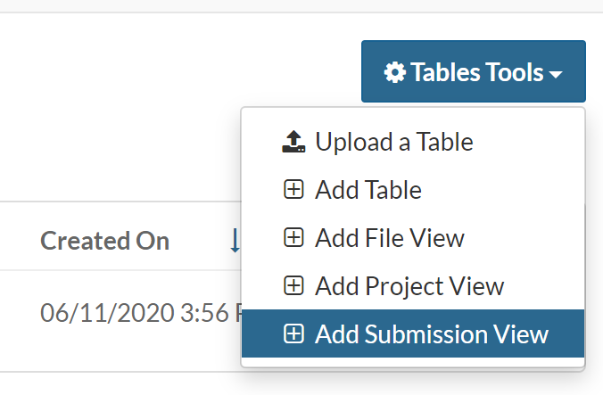
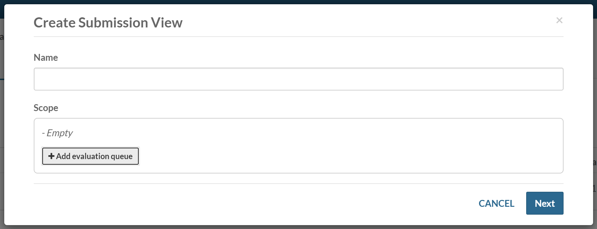
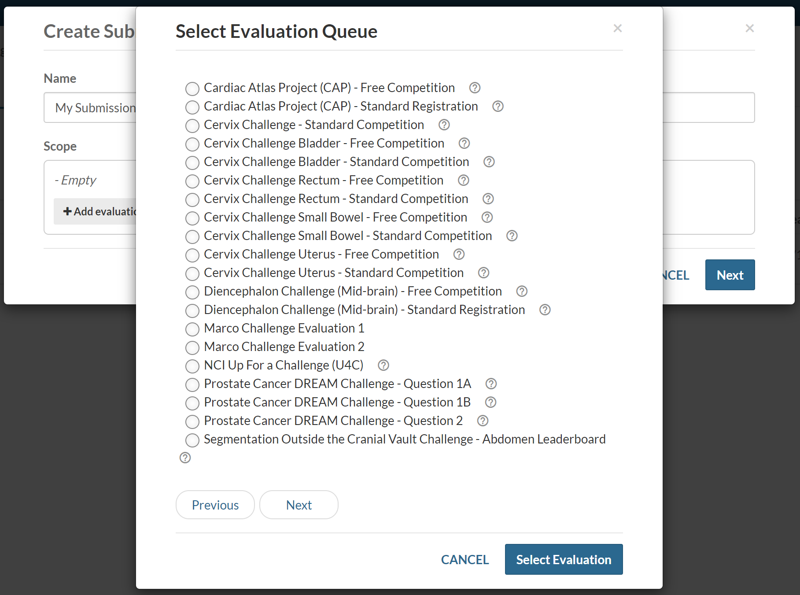
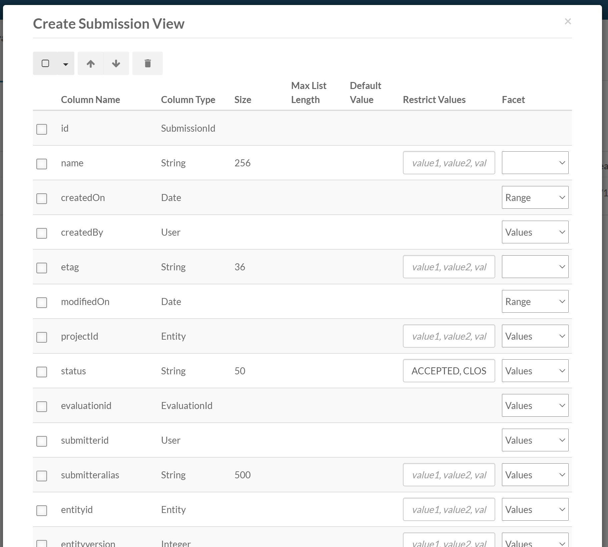
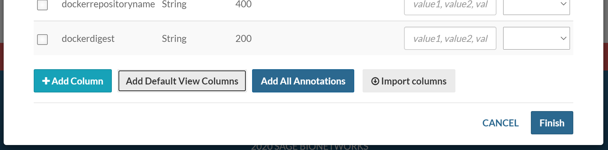
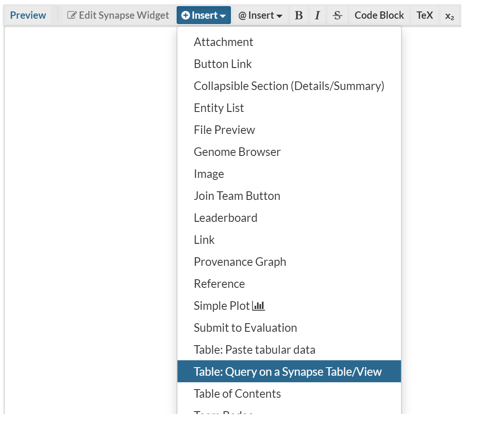
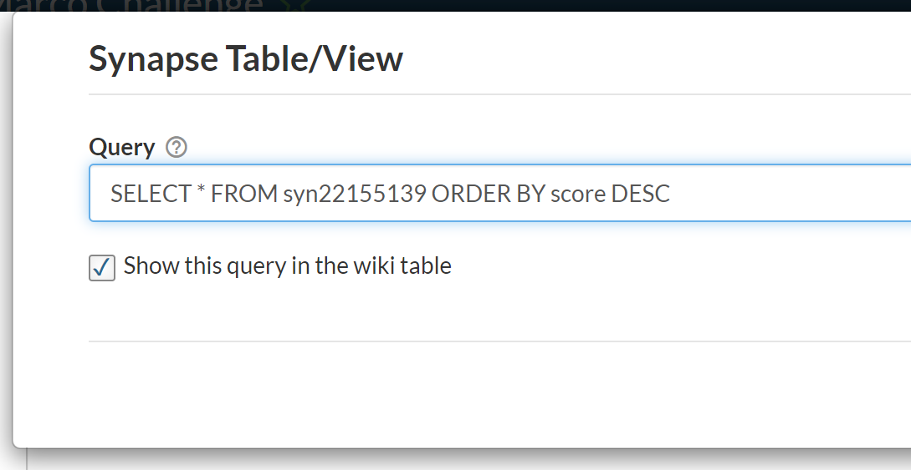

---

title: Evaluation Queues
layout: article
excerpt: A Synapse Queue contains user submitted models or files to execute for challenges and benchmarking.
category: reproducible-research
---

An Evaluation queue allows for people to submit Synapse `Files`, `Docker` images, etc. for evaluation. They are designed to support open-access data analysis and modeling challenges in Synapse. This framework provides tools for administrators to collect and analyze data models from Synapse users created for a specific goal or purpose.

## Create an Evaluation Queue

To create a queue, you must first create a Synapse `Project` or have [edit permissions]({{ site.baseurl }}#edit-permissions) on an existing Project. To create a Synapse Project, follow the instructions on the [Project and Data Management]({{ site.baseurl}}#making-and-managing-projects-in-synapse) page. 

Once you've created your project, navigate to it and add `/challenge` to the url (e.g. www.synapse.org/#!Synapse:syn12345/challenge). Click **Tools** in the right corner and select **Add Evaluation Queue**.


An Evaluation queue can take several parameters that you can use to customize your preferences.

* Name – Unique name of the evaluation
* Description – A short description of the evaluation
* Submission Instructions – Message to display to users detailing acceptable formatting for submissions.
* Submission Receipt Message – Message to display to users upon submission




### Setting Quotas on an Evaluation Queue

Optionally, you can restrict how things are submitted by using a quota.


An Evaluation queue can only have one quota. You may specify the length of time the queue is open, the start date, round duration, and number of rounds. These are required parameters. It is optional to set submission limit.

* First Round Start Date/Time - The date/time at which the first round begins.
* Number of Rounds - The number of rounds, or null if there is no limit to set.
* Submission Limit - The maximum number of submissions per team/participant per round. Please keep in mind that the system will prevent additional submissions by a user/team once they have hit this number of submissions.
* Round Duration  - The duration of each round. If you set a round duration you will want to set the number of rounds or it will assume an infinite number of rounds.


## Share an Evaluation Queue

Each Evaluation has sharing settings, which limit who can interact with the Evaluation.

* **Administrator** sharing should be tightly restricted, as it includes authority to delete the entire Evaluation queue and its contents. These users also have the ability to download all of the submissions.
* **Can Score** allows for individuals to download all of the submissions
* **Can Submit** allows for teams or individuals to submit to the Evaluation, but doesn't have access to any of the submissions.
* **Can View** allows for teams or individuals to view the submissions on a leaderboard.

To set the sharing settings, go to the **Challenge** tab to view your list of Evaluations.  Click on the **Share** button per Evaluation and share it with the teams or individuals you would like.



## Close an Evaluation Queue
While there isn't technically a way of "closing" an evaluation queue, there are multiple ways to discontinue submissions for users.

* Users are only able to submit to a queue if they have `can submit` permissions to it. If you have the ability to modify the permissions of a queue, you will still be able to submit to the queue due to your `administrator` access.
* If the quota is set so the current date exceeds the the round start + round duration, no one will be able to submit to the queue. This includes users with administrator permissions.
* Deleting a queue will also discontinue the ability to submit to it. Be careful when doing this, as deleting a queue is irreversible - you will lose all its submissions.


## Submitting to an Evaluation Queue

Any Synapse entity may be submitted to an Evaluation Queue.

In the R and Python examples, you need to know the ID of the evaluation queue. This ID must be provided to you by administrators of the queue. 

The submission function takes **two optional parameters**: `name` and `team`.  Name can be provided to customize the submission. The submission name is often used by participants to identify their submissions.  If a name is not provided, the name of the entity being submitted will be used. As an example, if you submit a File named testfile.txt, and the name of the submission isn't specified, it will default to testfile.txt. Team names can be provided to recognize a group of contributors.

##### Python

```python
import synapseclient

syn = synapseclient.login()

evaluation_id = "9610091"
my_submission_entity = "syn1234567"

submission = syn.submit(
    evaluation = evaluation_id,
    entity = my_submission_entity,
    name = "My Submission", # An arbitrary name for your submission
    team = "My Team Name") # Optional, can also pass a Team object or id
```

##### R

```r
library(synapser)

synLogin()

evaluation_id <- "9610091"
my_submission_entity <- "syn1234567"

submission <- synSubmit(
    evaluation = evaluation_id,
    entity = my_submission_entity,
    name = "My Submission", # An arbitrary name for your submission
    team = "My Team Name") # Optional, can also pass a Team object or id
```
## Submissions

Every submission you make to an Evaluation queue has a unique ID. This ID should not be confused with Synapse IDs which start with syn. All submissions have a `Submission` and `SubmissionStatus` object.

##### Web

Navigate to a file in Synapse and click on **Tools** in the upper right-hand corner. Select **Submit To Challenge** to pick the challenge for your submission. Follow the provided steps to complete your submission.


## View Submissions of an Evaluation Queue

Submissions can be viewed and shared with users through [Submission Views]({{ site.baseurl }}{% link _articles/views.md %#create-a-submission-view}) creating dynamic leaderboards. Submission annotations can be added to a SubmissionStatus object and are automatically indexed in the view.

### Creating the Submission View

Navigate to the **Tables** tab and under the **Table Tools** menu in the upper right-hand select **Add Submission View**:



You can name the view, and select the evaluation queues to include in the scope.



You can add multiple evaluation queues to the scope:





During the creation process the default columns for a submission view will be included:



Selecting **Add All Annotations** will automatically include all the annotations found on the submissions in the scope as columns for the view:



### Embed a Submission View in a Wiki Page

Once created, a submission view can be embedded into a wiki page using the Synapse Table/View wiki widget:



You can input your own query statement such as `SELECT * FROM syn22155139 ORDER BY score DESC`. Remember, 22155139 should be replaced with the id of the submission view:



### Submit to an Evaluation Queue from a Wiki Page


You may embed a `Submit To Evaluation` widget on a Wiki page to improve visibility of your Evaluation queue. The widget allows participants to submit to multiple Evaluation queues within a Project or a single Evaluation queue. 

Currently, this Wiki widget is required to submit Synapse Projects to an Evaluation queue. Synapse Docker repositories can not be submitted through this widget.


The "Evaluation Queue unavailable message" is customizable.  A queue may appear unavailable to a user if: 

* The Project doesn't have any Evaluation queues.
* The user does not have permission to view a Project's Evaluation queues. Learn more about [sharing settings]({{ site.baseurl }}).
* The Evaluation queue quota is set such that a user can not submit to the queue.  Learn more about [quotas]({{ site.baseurl }}#create-an-evaluation-queue).

# See Also

To learn how to create a Wiki page, please visit [the Wikis article]({{ site.baseurl }}).
