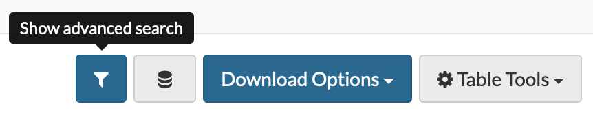

# Create Table and View Queries 

The data contained within a Table can be retrieved by using a SQL-like query language. Every Table contains the query to capture all of the data contained in it by default.




You may specify columns explicitly after the `SELECT` statement to subset the data.

```
SELECT age, gender FROM syn3079449
```

To keep all columns in the query and filter rows that meet a certain condition, incorporate a `WHERE` statement.

```
SELECT * FROM syn3079449 WHERE age > 50
```
Add an `ORDER BY` statement and a column name to sort the results by that column.

```sql
SELECT * FROM syn3079449 WHERE age > 50 ORDER BY "treatmentArm" ASC
```

 **See the [API docs](http://rest-docs.synapse.org/rest/org/sagebionetworks/repo/web/controller/TableExamples.html) for an enumeration of the types of queries that can be performed.**


COUNT, SELECT AS, and GROUP_CONCAT SQL statements are also supported. 

Count the number of rows.

```sql
SELECT count(*) FROM syn3079449
```

`SELECT` and rename a subset of columns.

```sql
SELECT age AS "Age at Diagnosis", gender AS "Gender" FROM syn3079449
```

To find out how many distinct treatment arms were studied, by gender:

```sql
SELECT count(distinct(treatmentArm)) AS "Number of Treatments", gender FROM syn3079449 group by gender
```

To list out the distinct treatent arms that were studied, by gender:

```sql
SELECT GROUP_CONCAT(distinct(treatmentArm) SEPARATOR ', ') AS "Available Treatments", gender as "By Gender" FROM syn3079449 group by gender
```
