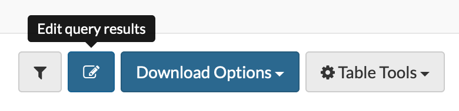
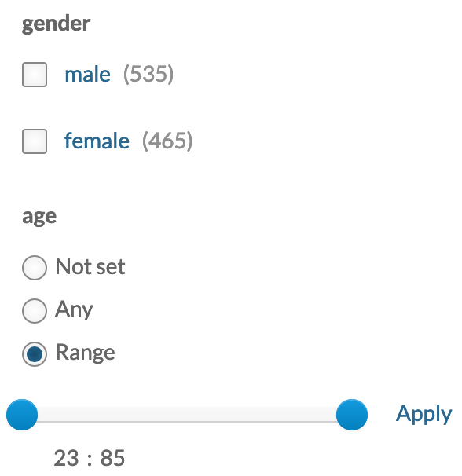

Synapse `Tables` are designed to provide users the ability to create web-accessible, sharable, and queryable data.

Tables may be queried and edited with the Synapse web UI, as well as, with the Synapse programmatic clients. This article guides you through [creating Tables]({{ site.baseurl }}#create-tables) and [querying existing Tables]({{ site.baseurl }}#query-tables).

To learn more about creating new Tables and creating queries for existing Tables using one of the programmatic clients, see:

* Tables in [Python Docs](https://python-docs.synapse.org/build/html/Table.html).
* Tables in [R Docs](https://r-docs.synapse.org/articles/tables.html).

**What is a schema?**

A **_schema_** defines the Table structure by explicitly specifying the column names, types and sizes. You may also define the values allowed in each column.

Synapse Tables currently support several kinds of text (STRING, LARGE TEXT), dates (TIMESTAMP), numbers (INTEGER, DOUBLE), and links to Synapse entities and Synapse users (ENTITYID, USERID). For a complete list of column types and definitions, see the [REST docs on columnTypes](https://rest-docs.synapse.org/rest/org/sagebionetworks/repo/model/table/ColumnType.html).

## Create a New Table from a File

Tables require structured data contained in a _.csv_ or _.tsv_ file. If your structured data is saved in an Excel format such as _.xls_ or _.xlsx_, please "save-as" a _.csv_ to proceed. Navigate to the Tables tab in your Project and select **Upload a Table**. While Synapse will infer your Table schema based on the column header if you provide a _.csv_ or _.tsv_, you may further customize the schema by selecting **Schema Options**. 

For very large files, it may take time for the Table to be built and indexed completely before it can be viewed. You may navigate away from the Table once you have clicked **Create** and will not lose any data. 

## Create an Empty Table

You have the option to create an empty table by clicking on **Tables Tools** and **Add Table**. To build a new Table, you must specify the Table structure, column by column. Select **Add Column** to set the Column Name, Column Type, Size, Default Value, Restrict Values

If you have created an empty Table, you will need to click on **Table Tools** and **Upload Data to Table** to upload data from a _.csv_ or _.tsv_ file. The first line of your file must match the Table structure specified.  

Alternatively, you may add rows individually using the web UI. To add, delete or modify existing rows, click on the **Edit Query Results** icon to Edit Rows. 

Click the **+** sign to add rows. To delete rows, check the boxes of the rows to delete and click the **Trash Can** icon. 

## Schema Options

Click **Table Tools**, **Show Table Schema** and **Edit Schema** to modify the existing Table structure. From **Edit Schema**, you can delete columns, add new columns, modify existing columns, define default column values, restrict column values and facet values. 

### Structure your Data to be Searchable

#### Simple Search

A simple search is a faceted search. A faceted search allows users to apply several conditions by clicking to narrow down a search. Simple search uses radio buttons and sliders to show all available facets in a menu to the left of the `Table`. 

To set simple search, return to the schema editor by selecting **Table Tools**, **Show Table Schema** and **Edit Schema**. Many column types support faceting. In the Edit Columns pane, select **Values** or **Range** from the dropdowns under the Facet option. **Values** can be thought of as categories whereas **Range** is a date or number.

#### Advanced Search

Advanced search employs a SQL-like query to filter the `Table`.

# Files in a Table

Synapse `Tables` support a special column type called `File` which contain a file handle, an identifier of a file stored in Synapse. Here’s an example of how to upload files into Synapse, associate them with a table and read them back later.

First, add a new column for files in the table we're currently working with. To add columns, click on the **Schema** button. From there, select the **Edit Schema** button and then add columns using the **Add Column** button located at the bottom of the pop-up and set the **Column Type** as **File**.

Next, retrieve the most current table and save as a data frame. Click **Save** to save your latest schema.

Next, upload the files; click on the **Edit icon** to the right of the **Query** button. In the resulting pop-up, you can upload files by clicking the **Upload icon** then **Browse** and selecting the file from your local directory. Save the new table.

Finally, query the table and download the album cover files. Clicking on any file will download it.

# See Also

[Annotations and Queries]({{ site.baseurl }}), [Downloading Data]({{ site.baseurl }}), [Files and Versioning]({{ site.baseurl }})
